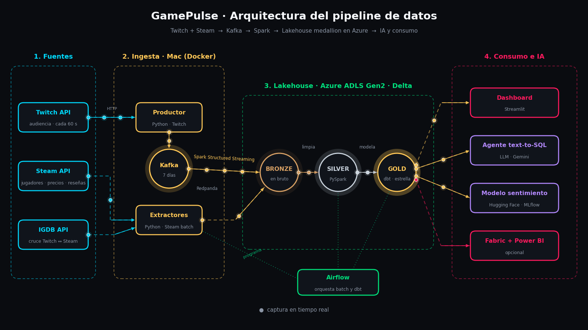
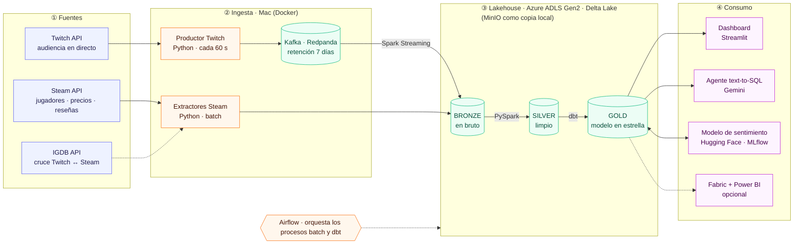
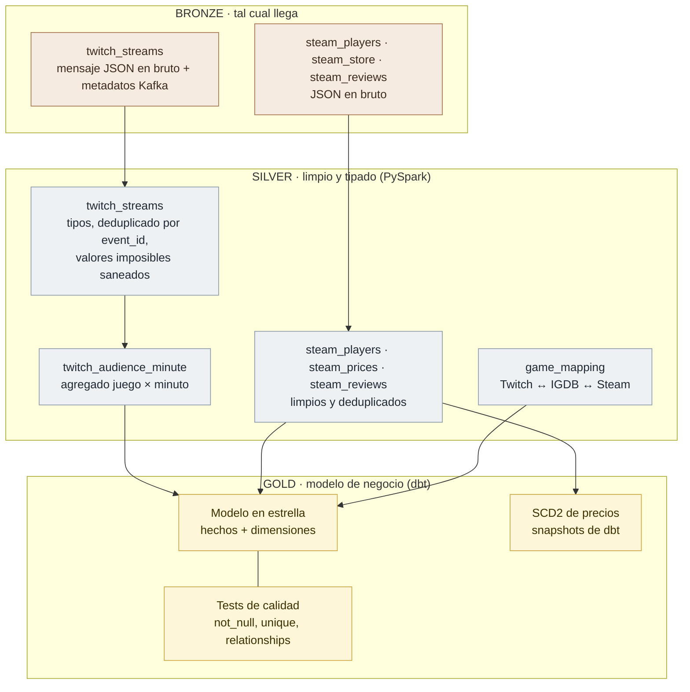
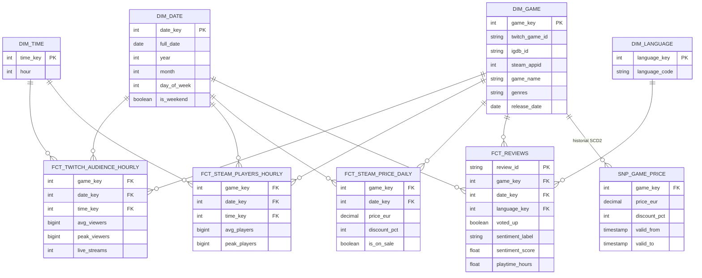
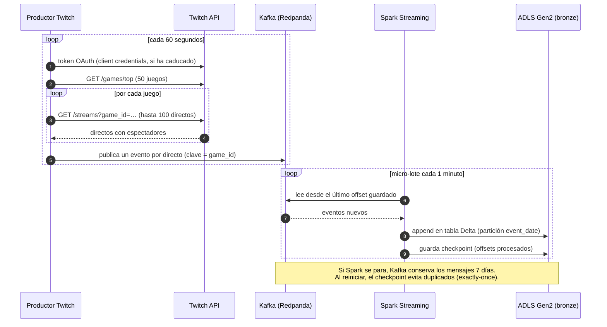
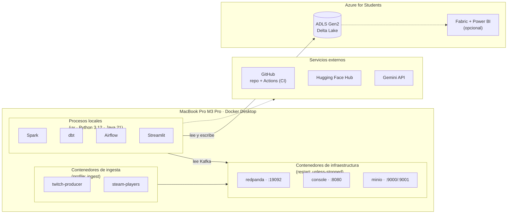
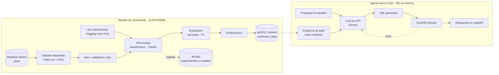
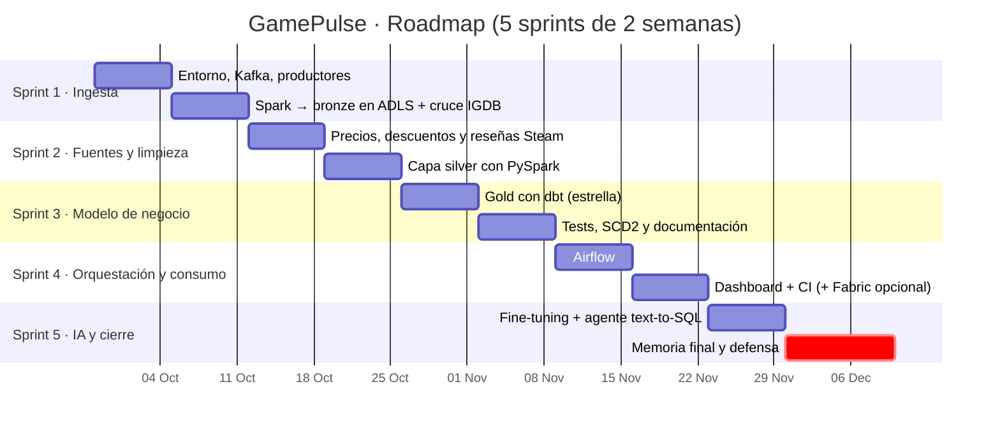

# Diagramas de GamePulse

Los diagramas están escritos en **Mermaid** (código en `src/`). GitHub los dibuja directamente en esta página; las versiones en imagen para la memoria y las diapositivas están en `svg/` (vectorial, recomendada) y `png/`.

Para regenerar las imágenes tras editar un `.mmd`:

```bash
make diagrams
```

## Arquitectura animada



Generada con matplotlib (`animated/arquitectura_animada.py`). Para regenerarla:

```bash
uv run --with matplotlib --with pillow python docs/diagrams/animated/arquitectura_animada.py
```

## Índice

- [Arquitectura general](#arquitectura-general)
- [Flujo por capas (medallion)](#flujo-por-capas-medallion)
- [Modelo en estrella (gold)](#modelo-en-estrella-gold)
- [Secuencia de la ingesta en streaming](#secuencia-de-la-ingesta-en-streaming)
- [Despliegue](#despliegue)
- [Las dos piezas de IA](#las-dos-piezas-de-ia)
- [Roadmap por sprints](#roadmap-por-sprints)

## Arquitectura general

Componentes del sistema y dónde vive cada uno: fuentes, ingesta en el Mac, lakehouse en Azure y consumo.



Imagen: [`svg/01_arquitectura.svg`](svg/01_arquitectura.svg) · [`png/01_arquitectura.png`](png/01_arquitectura.png)

## Flujo por capas (medallion)

Qué contiene cada capa y qué transformación la produce: bronze (bruto), silver (limpio, PySpark) y gold (negocio, dbt).



Imagen: [`svg/02_medallion.svg`](svg/02_medallion.svg) · [`png/02_medallion.png`](png/02_medallion.png)

## Modelo en estrella (gold)

Hechos y dimensiones de la capa gold, más el historial SCD2 de precios.



Imagen: [`svg/03_modelo_estrella.svg`](svg/03_modelo_estrella.svg) · [`png/03_modelo_estrella.png`](png/03_modelo_estrella.png)

## Secuencia de la ingesta en streaming

Cómo viaja un dato de Twitch hasta bronze y cómo se garantiza que no se pierde ni se duplica.



Imagen: [`svg/04_secuencia_ingesta.svg`](svg/04_secuencia_ingesta.svg) · [`png/04_secuencia_ingesta.png`](png/04_secuencia_ingesta.png)

## Despliegue

Contenedores, procesos locales, servicios de Azure y servicios externos.



Imagen: [`svg/05_despliegue.svg`](svg/05_despliegue.svg) · [`png/05_despliegue.png`](png/05_despliegue.png)

## Las dos piezas de IA

El modelo de sentimiento que se entrena (fine-tuning) y el agente text-to-SQL que usa un LLM por API.



Imagen: [`svg/06_pipeline_ia.svg`](svg/06_pipeline_ia.svg) · [`png/06_pipeline_ia.png`](png/06_pipeline_ia.png)

## Roadmap por sprints

Planificación del TFG en 5 sprints de 2 semanas.



Imagen: [`svg/07_roadmap.svg`](svg/07_roadmap.svg) · [`png/07_roadmap.png`](png/07_roadmap.png)
