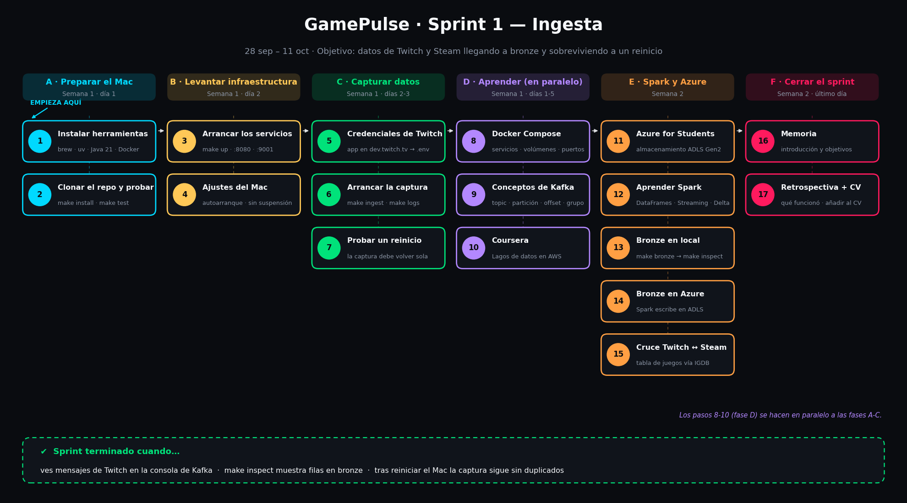

# Sprint 1 — Ingesta (28 sep – 11 oct)

**Objetivo:** datos de Twitch y Steam llegando a bronze y sobreviviendo a un reinicio.

Marca cada paso al terminarlo (en GitHub puedes editar este archivo y cambiar `[ ]` por `[x]`).

## A · Preparar el Mac (semana 1, día 1) — **empieza aquí**
- [x] **1. Instalar herramientas:** `xcode-select --install`, Homebrew, `brew install uv openjdk@21`, Docker Desktop (Memory ≥ 8 GB)
- [x] **2. Clonar el repo y probar:** `make install` → `make test` (debe salir `8 passed`)

## B · Levantar la infraestructura (día 2)
- [x] **3. Arrancar los servicios:** `make up` → abrir http://localhost:8080 (Kafka) y http://localhost:9001 (MinIO, `minioadmin`/`minioadmin`)
- [x] **4. Ajustes del Mac:** Docker Desktop → *Start Docker Desktop when you sign in* · Batería → evitar suspensión con el adaptador conectado

## C · Capturar datos (días 2-3)
- [x] **5. Credenciales de Twitch:** crear la app en https://dev.twitch.tv/console/apps y copiar Client ID y Secret en `.env`
- [x] **6. Arrancar la captura:** `make ingest` y comprobar con `make logs` que se envían snapshots
- [ ] **7. Probar un reinicio:** reiniciar Docker Desktop (o el Mac) y verificar con `make status` que la captura vuelve sola

## D · Aprender (en paralelo a A-C, días 1-5)
- [ ] **8. Docker Compose:** servicios, volúmenes, puertos, `depends_on`, `restart`
- [ ] **9. Kafka:** topic, partición, offset, consumer group, retención
- [ ] **10. Coursera:** *Creación de lagos de datos en AWS*

## E · Spark y Azure (semana 2)
- [ ] **11. Azure for Students:** activar con el correo de la UAX y crear la cuenta de almacenamiento ADLS Gen2 (guiado)
- [ ] **12. Aprender Spark:** DataFrames, evaluación perezosa, Structured Streaming, checkpoints, Delta Lake
- [ ] **13. Bronze en local:** `make bronze` → `make inspect`
- [ ] **14. Bronze en Azure:** configurar Spark para escribir en ADLS Gen2 (`abfss://`)
- [ ] **15. Cruce Twitch ↔ Steam:** tabla de juegos vía IGDB (`igdb_id` → `appid` de Steam)

## F · Cerrar el sprint (último día)
- [ ] **16. Memoria:** introducción y objetivos
- [ ] **17. Retrospectiva + CV:** una línea de qué funcionó y qué costó · añadir GamePulse al CV como proyecto en desarrollo con enlace al repo

## ✔ Sprint terminado cuando…
- Se ven mensajes de Twitch en la consola de Kafka.
- `make inspect` muestra filas en bronze.
- Tras reiniciar el Mac, la captura sigue sin duplicados.

## Retrospectiva
- **Qué funcionó:**
- **Qué costó:**
- **Qué cambio para el Sprint 2:**
